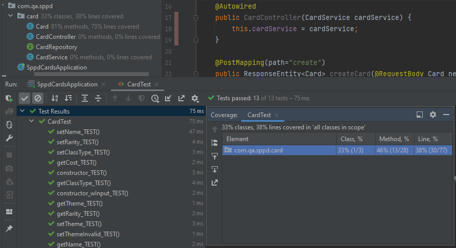
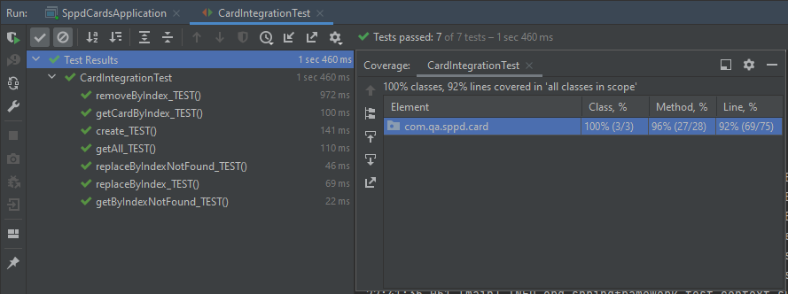

# South Park Phone Destroyer - Game Cards


## Overview

This is the final training project for QA Academy Software Development program. 
It encapsulates concepts from all core modules:
* Agile & Project Management (Git, Jira)
* Databases & Cloud Fundamentals (H2, MySQL)
* Programming Fundamentals (Java)
* API Development (Spring Boot)
* Automated Testing (JUnit)
Additionally it is fully CRUD functional, handles HTTP request and communicates with a database.

The project is a Spring Boot App customised to emulate cards from m/obile game South Park Phone Destroyer 
([Google Play link](https://play.google.com/store/apps/details?id=com.ubisoft.dragonfire&hl=en_GB&gl=US)).
In the most basic form, it allows to create, read, update and delete card objects from a database.
This results in an application back-end, with cloud based database.

Development stages are captured on Jira Board and accessible using 
[this](https://albert-kuc.atlassian.net/jira/software/projects/SPPD/boards/1) link. 
<hr>

## How to use

### Card class 

The intention of the Card class is to simulate existing game cards.<br>
An instance of the class contains some typical game characteristics (variables):
* name - character's name
* theme - groups characters by similar outfits and abilities
* classType - groups cards by similar abilities and attributes
* rarity - represents how unique a card is
* cost - number of energy points required to use a card during gameplay

### API functionality

The application runs on a local server with default port set to 8080.<br>
It is capable of handling HTTP requests from a tool such as **Postman**.

The following CRUD functionality is allowed:

* create card 
* get all cards
* get card 
* update card 
* delete card 

<hr>

### Functionality explained

In this section the functionality is explained in details and sample requests are shown using **Postman**.


<p align = "center">
Fig.1 - Postman panel
</p>

<hr>

#### Create card

To create a new card use **/card/create** extension.<br>
This request requires providing input data in specified format.

###### Using Postman:

1. Create `New` -> `HTTP Request`
2. Ensure `POST` request is selected from drop-down list
3. Enter URL: http://localhost:8080/card/create
4. To enter required input, select `Body` -> `raw` (ensure `JSON` type is selected from the drop-down list)
5. Enter input body. Sample input: 
```
{
    "name": "Program Stan",
    "theme": "sci-fi",
    "classType": "fighter",
    "rarity": "epic",
    "cost": 3
}
```
6. Select `SEND` button


<p align = "center">
Fig.2 - Postman POST request and output
</p>

<hr>

#### Get all cards

To read all cards from database use **/card/getAll** extension.<br>

###### Using Postman:

1. Create `New` -> `HTTP Request`
2. Ensure `GET` request is selected from drop-down list
3. Enter URL: http://localhost:8080/card/getAll
4. Select `SEND` button

<hr>

#### Get card

To read a specific card from database use **/card/get/(index)** extension, 
where (index) needs to be replaced with an Integer. 
By default the card index is set to 1.

###### Using Postman:

1. Create `New` -> `HTTP Request`
2. Ensure `GET` request is selected from drop-down list
3. Enter URL: http://localhost:8080/card/get/1
4. Select `SEND` button

<hr>

#### Update card

To update a specific card from database use **/card/replace/(index)** extension,
where (index) needs to be replaced with an Integer.
By default the card index is set to 1.<br>
This request requires providing input data in specified format.

###### Using Postman:

1. Create `New` -> `HTTP Request`
2. Ensure `PUT` request is selected from drop-down list
3. Enter URL: http://localhost:8080/card/replace/1
4. To enter required input, select `Body` -> `raw` (ensure `JSON` type is selected from the drop-down list)
5. Enter input body. Sample input:
```
{
    "name": "Program Stan",
    "theme": "sci-fi",
    "classType": "fighter",
    "rarity": "epic",
    "cost": 3
}
```
6. Select `SEND` button

<hr>

#### Delete card

To delete a specific card from database use **/card/remove/(index)** extension,
where (index) needs to be replaced with an Integer.
By default the card index is set to 1.

###### Using Postman:

1. Create `New` -> `HTTP Request`
2. Ensure `DELETE` request is selected from drop-down list
3. Enter URL: http://localhost:8080/card/remove/1
4. Select `SEND` button

<hr>

## Test

### Unit test

Card class unit test checks functionality of class constructors, getters and setters.<br>
Testing Card class after it was created allowed to fix simple bugs at the early stage of the project.

Unit test coverage for the Card class is 81%, although overall coverage indicated by IDE is 33%.<br>
It is the result of CardService and CardController classes being covered in 0%. 
Both are tested by integration test.  



<p align = "center">
Fig.3 - CardTest with coverage
</p>

### Integration test

Card integration test checks correct CRUD functionality of API related to Card class.<br>
Performing test highlighted issues in service functionality, e.g. different response than expected, 
or lack of error handling for calling non-existing index from database.



<p align = "center">
Fig.4 - CardIntegrationTest with coverage
</p>

## TODO readme requirements 

You are also expected to make a README.md file and to fill this README with information about this project. 
It should contain the following headers:
* **Why are we doing this?**<br>
This project allows me to gain software development practice and experience. 
Before this bootcamp I was programming using Python, based on what I have learned from online tutorials and books.
The content varied around data science, ML and AI, but mostly felt non-practical to reproduce. 
This Card class API development touches on various subjects and different layers of development.
It is related not only to coding but also Agile practices.
* **How I expected the challenge to go.**<br>
I have expected to complete the challenge much faster, somewhere in the middle of the week.
Equivalent project was presented during the course, so repeating it felt too easy. 
This is the reason I didn't follow the exact development steps but rather experimented on my own.
My pedantic nature also slowed my down as usual because I've focused on many bugs on the way instead of progressing.
On the other hand I've experienced unexpected challenges on the way which required consultations, research and fixing.
* **What went well? / What didn't go as planned?**<br>
  * The project works ok in the very basic form, so that is according to plan.
    On the other hand I expected to spend some time beyond the basic project scope, 
    either with stretch goals or experimenting with my own ideas.<br>
  * The first day I've spent on understanding how to use Jira with Git and GitHub. 
    That was also unexpected at first but the result is satisfying.
  * Both Integration Testing and Unit Testing highlighted some unexpected issues, which required extra time for review. 
* **Possible improvements for future revisions of the project.**
  * Few Card variables on object instantiation require input matching strings from predefined list. 
    Those could be replaced with enum.
  * Methods like getCardByIndex not only return card, but also handle request with non-existing index.
    That seems like breaking the single responsibility rule and could be moved to another class.
  * Some game cards have unique attributes which haven't been introduced yet, e.g. flying (not reachable by malee units), 
    deathWish (triggers an event when killed), warcry (triggers an event when spawned), etc. 
    Potentially that could be tackled using Liskov Substitution, 
    but not sure would that means for API usage related to controller, service and repo. 
* Screenshots showing your postman requests and the output from the API.
* Screenshots of your database to prove that data is being persisted.
* Screenshot of your test results, including coverage report.
* [Link](https://albert-kuc.atlassian.net/jira/software/projects/SPPD/boards/1) to Jira Board 